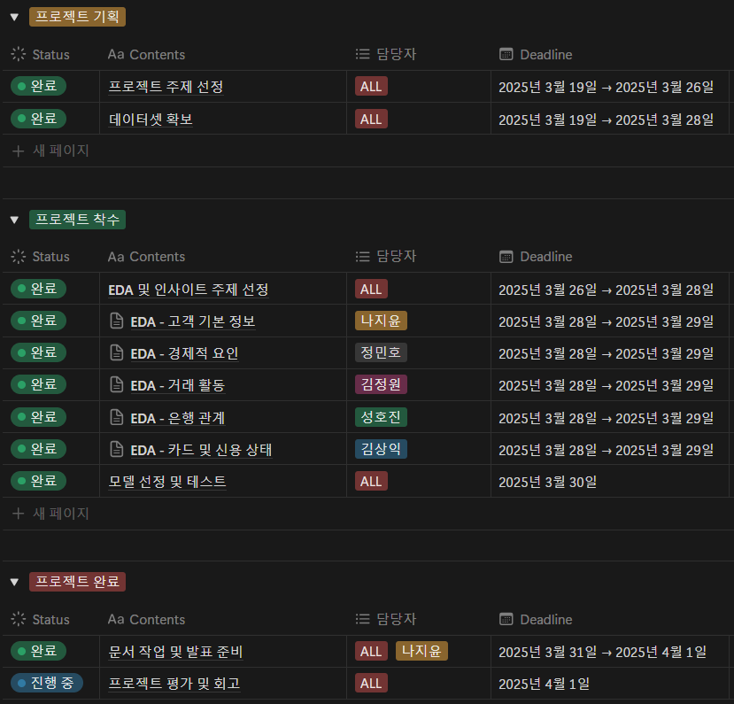

# 🪙 은행 고객 이탈 예측 프로젝트 🪙 

## 🏦 목차 🏦 
### 1. 팀 소개
### 2. 프로젝트 개요
### 3. EDA
### 4. 모델 선정 및 성능 평가
### 5. 프로젝트 결과
### 6. 한 줄 회고평

---
## 🏦 팀 소개 🏦

- **팀명: 오인조**

  <table>
    <thead>
      <td align="center">
        <a href="https://github.com/DawnSurplus">
           
          <strong>성호진</strong>
        </a> 
      </td>
      <td align="center">
        <a href="https://github.com/GTU9">
           
          <strong>김상익</strong>
        </a> 
      </td>
      <td align="center">
        <a href="https://github.com/Nadaeji">
           
          <strong>나지윤</strong>
        </a> 
      </td>
      <td align="center">
        <a href="https://github.com/Kimjeongwon12">
           
          <strong>김정원</strong>
        </a> 
      </td>
      <td align="center">
        <a href="https://github.com/Minor-Mino">
           
          <strong>정민호</strong>
        </a> 
      </td>
    </thead>
  </table>

---
## 🏦 프로젝트 개요 🏦

### 💰 프로젝트 배경 

- "신한은행은 2023년 기준, 전년 대비 1조 3천억 원 이상 감소한 31조 9,066억 원의 순이익 기록"

-  "머니 무브(Money Move)"  
  ***만기 도래한 고금리 상품 해지 이후 고객 자산이 경쟁 금융사로 빠르게 이동하는 현상***

---
### 💰 고객 이탈의 주요 배경 

🔹 **CMA 등 대체 금융상품 선호 증가**
 -  "금융투자협회에 따르면, CMA 잔고는 전년 대비 60조 원 이상 증가" 
 - ***고객 자금이 더 높은 수익률을 찾아 이동하고 있음이 확인됨***

🔹 **젊은 세대의 이탈 가속화**  
 - "20~34세 고객의 은행 이탈 경험률: 61.9%"
 - ***전통 은행보다 디지털 중심 플랫폼 기반 금융 서비스로 이동***

🔹 **고령 고객층 중심으로 고객 구조 재편**  
 - "4대 시중은행의 50대 이상 고객 비중: 2020년 38.1% → 2024년 43.5%"
 - "반대로 20·30대 고객 비중은 지속 감소"
 - ***고령층 자산 규모 및 금융 영향력 증가***

  <table>
    <tr>
      <td align="center" valign="middle">
         
      </td>
    </tr>
  </table>

---
### ❕ 퇴직연금 자금 유출까지 겹친 위기 ❕

> '2023년 퇴직연금 실물이전 제도 시행 이후,  
  ***신한은행은 1,624억 원 규모의 퇴직연금 자금을 유출***,  
  전 금융권 중 이탈 규모 1위를 기록했습니다.'

🔹 대부분 **경쟁력 높은 증권사로 유입**되었으며,  
🔹 같은 금융그룹 내 유입도 적어 **그룹 차원 손실**로 이어짐

---
### 💰 프로젝트 필요성 

이러한 상황은 단순한 고객 변동을 넘어,  
🔹 **고객의 이탈 행동을 데이터 기반으로 예측**하고,  
🔹 **세대별 맞춤형 유지 전략을 수립**할 수 있는 기반 마련의 필요성 강하게 시사

  <table>
    <tr>
      <td align="center" valign="middle">
         
      </td>
    </tr>
  </table>

---
### 🛠 기술 스택

|  분야  |  사용 기술  |
|------|------|
|  언어 |  |
|  데이터 분석 | ,  |
|  시각화 |   |
|  협업 |   |

---
### 🛠 WBS

  <table>
    <tr>
      <td align="center" valign="middle">
         
      </td>
    </tr>
  </table>

---
## 🏦 데이터 전처리
### 💰 데이터 로드 

  <table>
    <tr>
      <td align="center" valign="middle">
         
      </td>
    </tr>
  </table>

### 💰 데이터 드랍 

  <table>
    <tr>
      <td align="center" valign="middle">
         
      </td>
    </tr>
  </table>

### 💰 데이터 결측치 확인 

  <table>
    <tr>
      <td align="center" valign="middle">
         
      </td>
    </tr>
  </table>

### 💰 데이터 이상치 확인 

  <table width="100%" cellspacing="0" cellpadding="0">
    <tr><td align="center">
      
    </td></tr>
    <tr><td align="center">
      
    </td></tr>
    <tr><td align="center">
      
    </td></tr>
  </table>

### 💰 각 열 데이터 확인 

  <table width="100%" cellspacing="0" cellpadding="0">
    <tr><td align="center">
      
    </td></tr>
    <tr><td align="center">
      
    </td></tr>
  </table>

### 💰 이탈 여부 라벨 인코딩 

  <table>
    <tr>
      <td align="center" valign="middle">
         
      </td>
    </tr>
  </table>

### 💰 인코딩전 히트맵 시각화 

  <table width="100%" cellspacing="0" cellpadding="0">
    <tr><td align="center">
      
    </td></tr>
    <tr><td align="center">
      
    </td></tr>
  </table>

### 💰 인코딩_ 라벨 인코딩, 원 핫 인코딩 

  <table>
    <tr>
      <td align="center" valign="middle">
         
      </td>
    </tr>
  </table>

| **컬럼명** | **의미** |
| --- | --- |
| **Attrition_Flag** | 고객 이탈 여부 (타겟 변수)▪ Existing Customer (잔류)▪ Attrited Customer (이탈) |
| **Customer_Age** | 고객 나이 |
| **Gender** | 성별 (M/F) |
| **Dependent_count** | 부양가족 수 |
| **Education_Level** | 교육 수준 (예: Graduate, High School 등) |
| **Marital_Status** | 혼인 상태 (Married, Single 등) |
| **Income_Category** | 소득 구간 (예: $60K - $80K 등) |
| **Card_Category** | 보유한 카드 종류 (Blue, Silver, Gold 등) |
| **Months_on_book** | 해당 고객이 보유한 지 몇 개월 되었는지 (은행에 남아있는 기간) |
| **Months_Inactive_12_mon** | 최근 12개월 내 비활성 월 수 |
| **Avg_Utilization_Ratio** | 평균 신용카드 사용률 (리볼빙 잔고 / 한도) |
| **Avg_Open_To_Buy** | 평균 사용 가능한 신용금액 (Credit_Limit - Total_Revolving_Bal) |
| **Contacts_Count_12_mon** | 최근 12개월 내 고객센터에 연락한 횟수 |
| **Credit_Limit** | 고객의 신용한도 |
| **Total_Revolving_Bal** | 리볼빙 잔고 (돌려막기 용도의 카드 미지급액 등) |
| **Total_Amt_Chng_Q4_Q1** | 최근 1분기 대비 4분기 거래금액 변화율 |
| **Total_Trans_Amt** | 총 거래 금액 (최근 기간) |
| **Total_Trans_Ct** | 총 거래 횟수 (최근 기간) |
| **Total_Ct_Chng_Q4_Q1** | 거래 횟수의 분기 변화율 |
| **Total_Relationship_Count** | 총 금융상품 보유 개수 (예: 신용카드, 예금, 대출 등 포함 추정) |

---
## 🏦 EDA 🏦
https://ohgiraffers.notion.site/EDA-1c8649136c1180769a21dc042e28a60c?pvs=4

---
## 🏦 모델 선정 및 성능 평가 🏦
### 💰 1차 모델 학습_ 3가지 컬럼 제거 💰
- 제거한 컬럼명

| **컬럼명** | **의미** |
| --- | --- |
| **CLIENTNUM** | 고객 고유 번호 (ID)_ 예측에 직접 사용되진 않음 |
| **Naive_Bayes_Classifier_..._1** | 내부적으로 사용된 테스트용 예측 결과 (확률값)  |
| **Naive_Bayes_Classifier_..._2** | 내부적으로 사용된 테스트용 예측 결과 (확률값)  |

---
- 모델별 점수지표

🔹 LightGBM

  <table>
    <tr>
      <td align="center" valign="middle">
         
      </td>
    </tr>
  </table>

🔹 RandomForest

  <table>
    <tr>
      <td align="center" valign="middle">
         
      </td>
    </tr>
  </table>

🔹 XGBoost

  <table>
    <tr>
      <td align="center" valign="middle">
         
      </td>
    </tr>
  </table>

---
- 모델별 중요도

🔹 LightGBM

  <table>
    <tr>
      <td align="center" valign="middle">
         
      </td>
    </tr>
  </table>

🔹 RandomForest

  <table>
    <tr>
      <td align="center" valign="middle">
         
      </td>
    </tr>
  </table>

🔹 XGBoost

  <table>
    <tr>
      <td align="center" valign="middle">
         
      </td>
    </tr>
  </table>

---
### 💰 2차 모델 학습_ Total_ 컬럼 제외 💰

🔹 LightGBM

  <table>
    <tr>
      <td align="center" valign="middle">
         
      </td>
    </tr>
  </table>

🔹 RandomForest

  <table>
    <tr>
      <td align="center" valign="middle">
         
      </td>
    </tr>
  </table>

🔹 XGBoost

  <table>
    <tr>
      <td align="center" valign="middle">
         
      </td>
    </tr>
  </table>

---
### 💰 3차 모델 학습_ Total_ 컬럼 제외 & SMOTE 💰

🔹 LightGBM

  <table>
    <tr>
      <td align="center" valign="middle">
         
      </td>
    </tr>
  </table>

🔹 RandomForest

  <table>
    <tr>
      <td align="center" valign="middle">
         
      </td>
    </tr>
  </table>

🔹 XGBoost

  <table>
    <tr>
      <td align="center" valign="middle">
         
      </td>
    </tr>
  </table>

### 💰 4차 모델 학습_ Fake 데이터 추가 (최종) 💰

🔹 LightGBM

  <table>
    <tr>
      <td align="center" valign="middle">
         
      </td>
    </tr>
  </table>

🔹 RandomForest

  <table>
    <tr>
      <td align="center" valign="middle">
         
      </td>
    </tr>
  </table>

🔹 XGBoost

  <table>
    <tr>
      <td align="center" valign="middle">
         
      </td>
    </tr>
  </table>

🔹 LightGBM

  <table>
    <tr>
      <td align="center" valign="middle">
         
      </td>
    </tr>
  </table>

🔹 RandomForest

  <table>
    <tr>
      <td align="center" valign="middle">
         
      </td>
    </tr>
  </table>

🔹 XGBoost

  <table>
    <tr>
      <td align="center" valign="middle">
         
      </td>
    </tr>
  </table>

---
### 💰 평가지표 💰

🔹 **정확도 (Accuracy)**  | **정밀도 (Precision)** | **재현율 (Recall)** | **F1-score** | **ROC-AUC Curve**  

🔹 LightGBM

  <table>
    <tr>
      <td align="center" valign="middle">
         
      </td>
    </tr>
  </table>

🔹 RandomForest

  <table>
    <tr>
      <td align="center" valign="middle">
         
      </td>
    </tr>
  </table>

🔹 XGBoost

  <table>
    <tr>
      <td align="center" valign="middle">
         
      </td>
    </tr>
  </table>

---
## 🏦 한 줄 회고평 🏦

> 성호진  
"데이터셋을 찾는 부분부터, 클래스 불균형으로 인한 모델 성능 개선하는데 어려움을 겪었습니다. 과적합을 해결(파라미터 최적화 )하는 부분과 데이터 편향 및 클래스 불균형을 해결하기 위해 더 많은 내용을 공부하고 적용해보며 다양한 경험을 할 수 있는 시간이었습니다."

> 김상익  
"은행 고객 이탈 예측 프로젝트를 진행했는데, 데이터 편향과 낮은 변수 상관관계 때문에 예측이 어려웠고, 모델 성능이 많이 떨어졌습니다. SMOTE와 파생변수로 보완했지만 한계가 있었고, 추후엔 비교적 많은 데이터셋을 찾아 최적의 데이터셋을 학습시켜야 한다고 생각했습니다."

> 나지윤  
"데이터가 잘 정제되어 있어 비교적 쉽게 프로젝트가 진행될 거 같아, 이번에는 보다 쉽게 진행하되 완벽하게 제 것으로 만드는 데에 목표를 두자고 생각했는데, 오히려 데이터가 너무 잘 정제되어 있어서 모델 성능이 떨어졌습니다. 이에 초반에 예상했던 것보다 많이 난항을 겪었고, 이번 프로젝트로 강사님께서 계속 말씀하신 'garbage in, garbage out'을 경험해보았다는 생각이 듭니다. 

> 김정원  
"지금까지 배운 것들을 활용하여 직접 실습하며 부딪혀 보면서 스킬들을 익힐 수 있었습니다. 타겟과의 상관관계가 그다지 세지 않았던 한 두개의 컬럼의 편향성으로 모델의 성능이 크게 차이 날 수 있다는 것도 처음 알 수 있었던 시간이었습니다."

> 정민호  
"배운 내용들을 바탕으로 직접 실습을 진행하며 값을 변화시키면서 모델 성능의 변화를 체감할수 있었습니다. 오류를 해결하면서 부족함을 많이 느꼈던것 같습니다."
