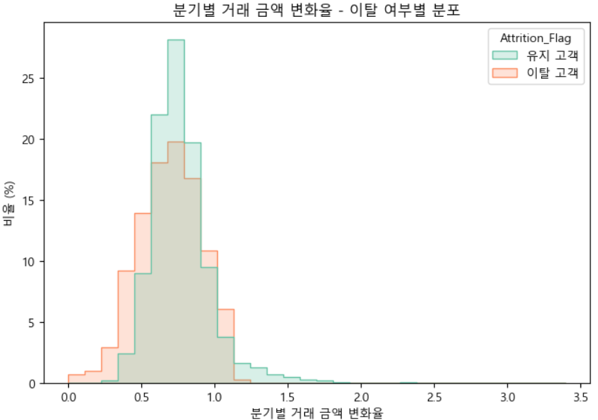
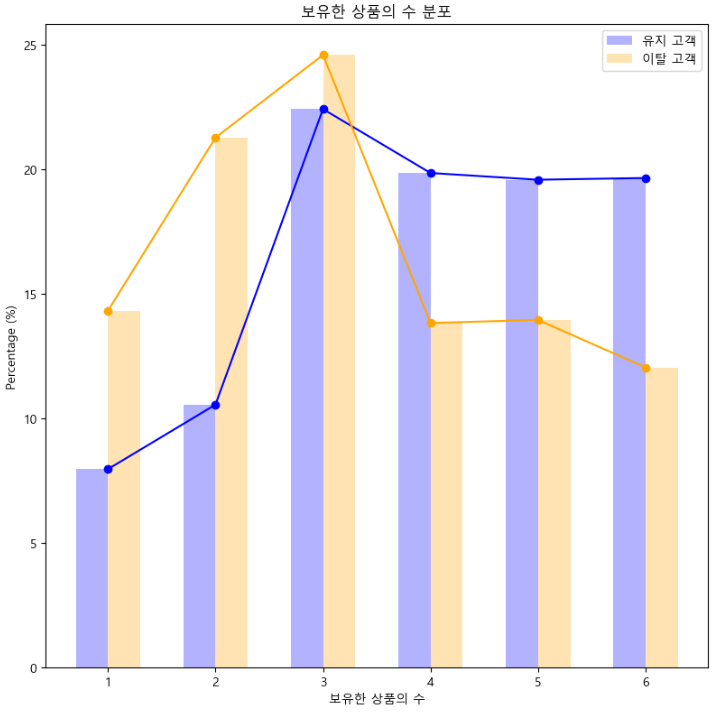

# 🪙 은행 고객 이탈 예측 프로젝트 🪙 

## 🏦 목차 🏦 
### 1. 팀 소개
### 2. 프로젝트 개요
### 3. EDA 및 이탈과의 관계 분석
### 4. 모델 선정 및 성능 평가
### 5. 프로젝트 결과
### 6. 한 줄 회고평

---
## 🏦 팀 소개 🏦

- **팀명: 오인조**
> **GitHub** 

<table width="80%" cellspacing="0" cellpadding="12" border="0">
  <tbody>
    <tr>
      <td align="center" width="20%"></td>
      <td align="center" width="20%"></td>
      <td align="center" width="20%"></td>
      <td align="center" width="20%"></td>
      <td align="center" width="20%"></td>
    </tr>
    <tr>
      <td align="center"><a href="https://github.com/GTU9"><strong>김상익</strong></a></td>
      <td align="center"><a href="https://github.com/Kimjeongwon12"><strong>김정원</strong></a></td>
      <td align="center"><a href="https://github.com/Nadaeji"><strong>나지윤</strong></a></td>
      <td align="center"><a href="https://github.com/DawnSurplus"><strong>성호진</strong></a></td>
      <td align="center"><a href="https://github.com/Minor-Mino"><strong>정민호</strong></a></td>
    </tr>
  </tbody>
</table>

---
## 🏦 프로젝트 개요 🏦

### 💰 프로젝트 배경 

- "신한은행은 2023년 기준, 전년 대비 1조 3천억 원 이상 감소한 31조 9,066억 원의 순이익 기록"

-  "머니 무브(Money Move)"  
  ***만기 도래한 고금리 상품 해지 이후 고객 자산이 경쟁 금융사로 빠르게 이동하는 현상***

---
### 💰 고객 이탈의 주요 배경 

🔹 **CMA 등 대체 금융상품 선호 증가**
 -  "금융투자협회에 따르면, CMA 잔고는 전년 대비 60조 원 이상 증가" 
 - ***고객 자금이 더 높은 수익률을 찾아 이동하고 있음이 확인됨***

🔹 **젊은 세대의 이탈 가속화**  
 - "20~34세 고객의 은행 이탈 경험률: 61.9%"
 - ***전통 은행보다 디지털 중심 플랫폼 기반 금융 서비스로 이동***

🔹 **고령 고객층 중심으로 고객 구조 재편**  
 - "4대 시중은행의 50대 이상 고객 비중: 2020년 38.1% → 2024년 43.5%"
 - "반대로 20·30대 고객 비중은 지속 감소"
 - ***고령층 자산 규모 및 금융 영향력 증가***

  <table>
    <tr>
      <td align="center" valign="middle">
         
      </td>
    </tr>
  </table>

---
### ❕ 퇴직연금 자금 유출까지 겹친 위기 ❕

> '2023년 퇴직연금 실물이전 제도 시행 이후,  
  ***신한은행은 1,624억 원 규모의 퇴직연금 자금을 유출***,  
  전 금융권 중 이탈 규모 1위를 기록했습니다.'

🔹 대부분 **경쟁력 높은 증권사로 유입**되었으며,  
🔹 같은 금융그룹 내 유입도 적어 **그룹 차원 손실**로 이어짐

---
### 💰 프로젝트 필요성 

이러한 상황은 단순한 고객 변동을 넘어,  
🔹 **고객의 이탈 행동을 데이터 기반으로 예측**하고,  
🔹 **세대별 맞춤형 유지 전략을 수립**할 수 있는 기반 마련의 필요성 강하게 시사

  <table>
    <tr>
      <td align="center" valign="middle">
         
      </td>
    </tr>
  </table>

---
### 🛠 기술 스택

|  분야  |  사용 기술  |
|------|------|
|  언어 |  |
|  데이터 분석 | ,  |
|  시각화 |   |
|  협업 |   |

---
### 🛠 WBS

  <table>
    <tr>
      <td align="center" valign="middle">
         
      </td>
    </tr>
  </table>

---
## 🏦 데이터 전처리
### 💰 데이터 로드 

  <table>
    <tr>
      <td align="center" valign="middle">
         
      </td>
    </tr>
  </table>

### 💰 데이터 드랍 

  <table>
    <tr>
      <td align="center" valign="middle">
         
      </td>
    </tr>
  </table>

### 💰 데이터 결측치 확인 

  <table>
    <tr>
      <td align="center" valign="middle">
         
      </td>
    </tr>
  </table>

### 💰 데이터 이상치 확인 

  <table width="100%" cellspacing="0" cellpadding="0">
    <tr><td align="center">
      
    </td></tr>
    <tr><td align="center">
      
    </td></tr>
    <tr><td align="center">
      
    </td></tr>
  </table>

### 💰 각 열 데이터 확인 

  <table width="100%" cellspacing="0" cellpadding="0">
    <tr><td align="center">
      
    </td></tr>
    <tr><td align="center">
      
    </td></tr>
  </table>

### 💰 이탈 여부 라벨 인코딩 

  <table>
    <tr>
      <td align="center" valign="middle">
         
      </td>
    </tr>
  </table>

### 💰 인코딩전 히트맵 시각화 

  <table width="100%" cellspacing="0" cellpadding="0">
    <tr><td align="center">
      
    </td></tr>
    <tr><td align="center">
      
    </td></tr>
  </table>

### 💰 인코딩_ 라벨 인코딩, 원 핫 인코딩 

  <table>
    <tr>
      <td align="center" valign="middle">
         
      </td>
    </tr>
  </table>

| **컬럼명** | **의미** |
| --- | --- |
| **Attrition_Flag** | 고객 이탈 여부 (타겟 변수)▪ Existing Customer (잔류)▪ Attrited Customer (이탈) |
| **Customer_Age** | 고객 나이 |
| **Gender** | 성별 (M/F) |
| **Dependent_count** | 부양가족 수 |
| **Education_Level** | 교육 수준 (예: Graduate, High School 등) |
| **Marital_Status** | 혼인 상태 (Married, Single 등) |
| **Income_Category** | 소득 구간 (예: $60K - $80K 등) |
| **Card_Category** | 보유한 카드 종류 (Blue, Silver, Gold 등) |
| **Months_on_book** | 해당 고객이 보유한 지 몇 개월 되었는지 (은행에 남아있는 기간) |
| **Months_Inactive_12_mon** | 최근 12개월 내 비활성 월 수 |
| **Avg_Utilization_Ratio** | 평균 신용카드 사용률 (리볼빙 잔고 / 한도) |
| **Avg_Open_To_Buy** | 평균 사용 가능한 신용금액 (Credit_Limit - Total_Revolving_Bal) |
| **Contacts_Count_12_mon** | 최근 12개월 내 고객센터에 연락한 횟수 |
| **Credit_Limit** | 고객의 신용한도 |
| **Total_Revolving_Bal** | 리볼빙 잔고 (돌려막기 용도의 카드 미지급액 등) |
| **Total_Amt_Chng_Q4_Q1** | 최근 1분기 대비 4분기 거래금액 변화율 |
| **Total_Trans_Amt** | 총 거래 금액 (최근 기간) |
| **Total_Trans_Ct** | 총 거래 횟수 (최근 기간) |
| **Total_Ct_Chng_Q4_Q1** | 거래 횟수의 분기 변화율 |
| **Total_Relationship_Count** | 총 금융상품 보유 개수 (예: 신용카드, 예금, 대출 등 포함 추정) |

---
## 🏦 EDA 및 이탈과의 관계 분석 🏦
- 각 칼럼명의 정의가 명확히 되어 있지 않아 이탈과의 **관계** 분석 진행

<!-- 1. 고객 기본 정보 분석 -->

  
<b>💰 1. 고객 기본 정보 분석</b> — Gender / Education_Level / Marital_Status / Income_Category / Card_Category

   

  - 고객의 인구통계학적 특성을 나타내는 열들로, 개인적 배경이 이탈에 미치는 영향을 분석
  
  ### 1.1. 특성
  - `Gender`: 성별
  - `Education_Level`: 교육수준
  - `Marital_Status`: 결혼여부
  - `Income_Category`: 소득수준
  - `Card_Category`: 카드등급
  
  ### 1.1.1. 성별에 따른 고객 비율 (이탈 vs 기존)
  

    <table>
      <tr>
        <td align="center" valign="middle">
           
        </td>
      </tr>
    </table>
  

  
  ### ✨ 인사이트
  - 여성 고객을 대상으로 한 **이탈 방지 캠페인 또는 충성도 프로그램** 설계 필요
      - 전체적으로 **여성 고객의 이탈 비율(85.4%)이 남성 고객(82.6%)보다 높음**
      - 성별에 따른 고객 행동 패턴 차이가 일부 존재할 수 있음
      - 하지만 차이는 크지 않기 때문에, **성별 단독 변수로는 강력한 예측 변수로 보기 어려움**
      - **다른 변수와 결합 분석(예: 성별 + 소득 + 카드 등급)** 필요
  
  ---
  ### 1.1.2. Education_Level (교육수준) - 고객 이탈 여부
  | **교육 수준** | **기존 고객 수** | **이탈 고객 수** | **기존 고객 비율** | **이탈 고객 비율** |
  | --- | --- | --- | --- | --- |
  | High School | 1,707 | 306 | 84.8% | 15.2% |
  | Graduate | 2,641 | 487 | 84.4% | 15.6% |
  | Uneducated | 1,250 | 237 | 84.1% | 15.9% |
  | College | 859 | 154 | 84.8% | 15.2% |
  | Post-Graduate | 424 | 92 | 82.2% | 17.8% |
  | Doctorate | 356 | 95 | 78.9% | 21.1% |
  | Unknown | 1,263 | 256 | 83.1% | 16.9% |
  
  

    <table>
      <tr>
        <td align="center" valign="middle">
           
        </td>
      </tr>
    </table>
  

  
  ### ✨ 인사이트
  - 낮은 교육 수준의 고객은 **상품 이해도 부족**, **채널 활용도 낮음** 등의 이유로 이탈 가능성 큼
  - 이들을 위한 **맞춤형 커뮤니케이션** 전략 중요
      - 전반적으로 **고학력자일수록 이탈률이 높아지는 경향**
      - 특히 **박사학위 고객(21.1%):** 가장 높은 이탈률 → **높은 지적 수준의 고객일수록 이탈 민감도↑**
      - 학력은 예측 변수로 활용 가치 있음
  
  ---
  ### 1.1.3. Marital_Status (결혼 여부) - 고객 이탈 여부
  | **결혼 상태** | **기존 고객 수** | **이탈 고객 수** | **기존 고객 비율** | **이탈 고객 비율** |
  | --- | --- | --- | --- | --- |
  | Married | 3,978 | 709 | 84.9% | 15.1% |
  | Single | 3,275 | 668 | 83.1% | 16.9% |
  | Divorced | 627 | 121 | 83.8% | 16.2% |
  | Unknown | 620 | 129 | 82.8% | 17.2% |
  
  
  

    <table>
      <tr>
        <td align="center" valign="middle">
           
        </td>
      </tr>
    </table>
  

  
  ### ✨ 인사이트
  - 기혼자는 재정적으로 안정적일 가능성이 크고, 장기적 관점에서 금융상품을 유지하려는 성향이 있습니다.
  - 반면 **싱글/이혼 고객층은 보다 적극적인 고객관리나 혜택 제공이 필요**할 수 있습니다.
      - **기혼 고객의 이탈률이 가장 낮음**
      - 결혼 상태가 안정된 고객은 **서비스 유지 확률이 더 높음**
      - **미혼/이혼/불명 상태일수록 이탈 가능성↑**
  
  ---
  ### 1.1.4. Income_Category (소득 수준) - 고객 이탈 여부
  
  | **소득 범위** | **기존 고객 수** | **이탈 고객 수** | **기존 고객 비율** | **이탈 고객 비율** |
  | --- | --- | --- | --- | --- |
  | $60K - $80K | 1,213 | 189 | **86.5%** | **13.5%** |
  | $40K - $60K | 1,519 | 271 | 84.9% | 15.1% |
  | $80K - $120K | 1,293 | 242 | 84.2% | 15.8% |
  | $120K + | 601 | 126 | 82.7% | 17.3% |
  | Less than $40K | 2,949 | 612 | 82.8% | 17.2% |
  | Unknown | 925 | 187 | 83.2% | 16.8% |
  
  

    <table>
      <tr>
        <td align="center" valign="middle">
           
        </td>
      </tr>
    </table>
  

  
  ### ✨ 인사이트
  - 중산층은 **타사 이동 여력**이 높고, **비용 대비 혜택 민감도**가 클 수 있습니다.
  - 해당 그룹을 위한 **차별화된 리텐션 전략**이 요구됩니다.
      - **중간 소득층($60K-$80K)**의 고객 이탈률이 가장 낮음 (13.5%)
      - 반대로 **고소득층과 저소득층 모두 이탈률이 더 높음**
      
      → **중산층**이 가장 안정된 고객군일 가능성
      
  ---
  ### 1.1.5. Card_Category (카드 등급) - 고객 이탈 여부
  | **카드 등급** | **기존 고객 수** | **이탈 고객 수** | **기존 고객 비율** | **이탈 고객 비율** |
  | --- | --- | --- | --- | --- |
  | Blue | 7,917 | 1,519 | 83.9% | 16.1% |
  | Silver | 473 | 82 | **85.2%** | 14.8% |
  | Gold | 95 | 21 | 81.9% | 18.1% |
  | Platinum | 15 | 5 | **75.0%** | **25.0%** |
  
  

    <table>
      <tr>
        <td align="center" valign="middle">
           
        </td>
      </tr>
    </table>
  

  
  ### ✨ 인사이트
  - 상위 등급 카드는 **혜택과 서비스 충성도**를 높이는 데 효과적입니다.
  - 중간 카드 등급 사용자의 이탈률이 높은 이유를 파악해, **혜택 개선** 또는 **등급 업그레이드 유도** 전략이 유효할 수 있습니다.
      - **Platinum 등급 고객은 이탈 비율이 가장 높지만, 샘플 수 적어 신뢰 낮음**
      - **Gold 등급 고객도 상대적으로 높은 이탈률**
      - 카드 등급이 높다고 반드시 충성도가 높은 건 아님 → **특정 등급 고객별 맞춤 관리 필요**

<!-- 2. 경제적 요인 -->

  
<b>💰 2. 경제적 요인</b> — Income_Category / Credit_Limit / Total_Revolving_Bal / Avg_Utilization_Ratio

   

  - 고객의 재정 상태와 신용카드 사용 패턴을 나타내는 열들로, 경제적 요인이 이탈에 미치는 영향 파악

  ### **2.1. 특성**
  - `Income_Category` : 소득 범주
  - `Credit_Limit` : 신용 한도
  - `Total_Revolving_Bal` : 총 리볼빙 잔액
  - `Avg_Utilization_Ratio` : 평균 이용률
  
  ---
  ### ✨ 인사이트
  ### 2.1.1. 이용률 대비 이탈 분류
  

    <table>
      <tr>
        <td align="center" valign="middle">
           
        </td>
      </tr>
    </table>
  

  
  - 이탈 고객들의 이용률이 유지 고객의 이용률보다 낮게 분포되어 있음
  
  ---
  ### 2.1.2. 리볼빙 잔액 분포
  

    <table>
      <tr>
        <td align="center" valign="middle">
           
        </td>
      </tr>
    </table>
  

  
  - 이탈 고객들의 리볼빙 잔액이 유지고객보다 더 낮게 분포되어 있음을 확인
  
  ---
  ### 2.1.3. 이용률 대비 리볼빙 잔액에 대한 고객 이탈 여부 분석
  

    <table>
      <tr>
        <td align="center" valign="middle">
           
        </td>
      </tr>
    </table>
  

  
  - 이용률이 낮고 리볼빙 잔액이 낮은 고객의 이탈이 높게 나올 것으로 예상되었으나, 이용률 0.6 이상부터 이탈 고객의 리볼빙 잔액이 유지 고객보다 훨씬 높게 도출
  
  ---
  ### 2.1.4. 거래 횟수 대비 리볼빙 잔액
  

    <table>
      <tr>
        <td align="center" valign="middle">
           
        </td>
      </tr>
    </table>
  

  
  - **유지 고객은 거래 횟수가 많을수록 평균 리볼빙 잔액이 증가**하는 경향이 있음
  - 이탈 고객의 경우, 일정 거래 횟수를 초과하면 리볼빙 잔액이 급증하는 패턴이 보임
  - 리볼빙 잔액이 적은 이탈 고객은 주로 중간 거래 횟수(40~80회) 구간에서 많이 존재
  
  ---
  ### 2.1.5 소득 대비 평균 이용률 분석
  

    <table>
      <tr>
        <td align="center" valign="middle">
           
        </td>
      </tr>
    </table>
  

  
  - 소득의 구간이 높을수록 이용률 또한 감소되는 것을 확인

<!-- 3. 거래 활동 -->

  
<b>💰 3. 거래 활동</b> — Total_Trans_Amt / Total_Trans_Ct / Total_Amt_Chng_Q4_Q1 / Total_Ct_Chng_Q4_Q1

   
  
  - 고객의 카드 거래 활동과 그 변화 추이를 나타내는 열들로, 사용 패턴이 이탈에 미치는 영향 분석
  
  ### **3.1. 특성**
  - `Total_Trans_Amt` : 총 거래 금액
  - `Total_Trans_Ct` : 총 거래 횟수
  - `Total_Amt_Chng_Q4_Q1` : 1분기 대비 4분기 총 거래금액 변화율(Q4/Q1)
  - `Total_Ct_Chng_Q4_Q1`  : 1분기 대비 4분기 총 거래횟수 변화율(Q4/Q1)
  
  ---
  ### ✨ 인사이트
  ### 3.1.1. 거래활동(금액·횟수)의 절대수준 저조·감소 추세에 따른 이탈 위험 급증
  - `Total_Trans_Amt`, `Total_Trans_Ct`, `Total_Amt_Chng_Q4_Q1`, `Total_Ct_Chng_Q4_Q1` 컬럼과 타겟인 Attrition_Flag를 비교했을 때, 네 개의 독립변수 모두 값이 적을 수록 이탈율이 높다는 것을 알 수 있음
  

    <table>
      <tr>
        <td align="center" valign="middle">
           
        </td>
      </tr>
    </table>
  

  
  ---
  ### 3.1.2. 총 거래 금액
  - `Total_Trans_Amt` : 총 거래 금액
      - 거래 금액이 적을수록 이탈률이 높음
      - 특히 하위 30%의 고객은 이탈 비중이 매우 큼
  

    <table>
      <tr>
        <td align="center" valign="middle">
           
        </td>
      </tr>
    </table>
  

  
  ---
  ### 3.1.3. 총 거래 횟수
  - `Total_Trans_Ct`  : 총 거래 횟수
      - 거래 횟수가 적을수록 이탈률이 높음
      - 60회 이하의 고객이 고위험군임.
  

    <table>
      <tr>
        <td align="center" valign="middle">
           
        </td>
      </tr>
    </table>
  

  
  ---
  ### 3.1.4. 1분기 대비 4분기 총 거래금액 변화율(Q4/Q1)
  - `Total_Amt_Chng_Q4_Q1` : 1분기 대비 4분기 총 거래금액 변화율(Q4/Q1)
      - 4분기 대비해서 거래 금액이 줄어들었다면 이탈의 조짐을 보인다 할 수 있음.
      - 지속적인 사용이 안정적임
  

    <table>
      <tr>
        <td align="center" valign="middle">
           
        </td>
      </tr>
    </table>
  

  
  - 위의 4개의 컬럼은 모두 고객의 카드 사용 활동성과 변화의 추이를 반영하고 있음 → 이탈 예측의 핵심 신호를 도출할 수 있음
  
  ---
  ### 3.1.5. 카드 ‘사용 수준 자체’가 낮은 고객 = 이탈 위험군
  
  - `Total_Trans_Amt`, `Total_Trans_Ct`가 낮은 고객은 **이탈률이 높음**
  - → **지속적으로 카드를 사용하지 않는 고객**은 관계 유지의 필요성을 느끼지 못할 가능성
  
  ---
  ### 3.1.6. 카드 ‘활동성의 변화’가 급격히 감소하는 고객 = 이탈 전조군
  
  - `Total_Amt_Chng_Q4_Q1`, `Total_Ct_Chng_Q4_Q1`가 **급감한 고객**은 이탈률이 높음
  - 특히 변화량이 0.5 이하인 고객에서 **급격한 이탈 증가 현상**이 포착됨

<!-- 4. 은행 관계 -->

  
<b>💰 4. 은행 관계</b> — Months_on_book / Total_Relationship_Count / Months_Inactive_12_mon / Contacts_Count_12_mon

   
  
  - 은행과의 관계 지속성과 상호작용 빈도를 나타내는 열들로, 충성도와 이탈 간 연관성 파악
  
  ### **4.1. 특성**
  - `Months_on_book` : 가입 기간 (개월)
  - `Total_Relationship_Count` : 보유한 상품 개수
  - `Months_Inactive_12_mon` : 지난 12개월 동안 거래를 하지 않은 기간 (개월)
  - `Contacts_Count_12_mon` : 지난 12개월 동안 고객과의 연락 횟수
    
  ### 4.1.1. 가입 고객 분포
  

    <table>
      <tr>
        <td align="center" valign="middle">
           
        </td>
      </tr>
    </table>
  

  
  - 유지 그룹과 이탈 그룹을 나누어 비교
  
  ---
  ### ✨ 인사이트
  
  ### 4.1.2. `Months_on_book` : 가입 기간 (개월)
  
  - 데이터는 전체적으로 가입기간 약 36개월(3년) 지점에서 유지 고객과 이탈 고객의 비율이 많음
      - 해당 시점에 신규 유입이 많았음을 의미 (대규모 광고나 캠페인을 진행 추정)
  

    <table>
      <tr>
        <td align="center" valign="middle">
           
        </td>
      </tr>
    </table>
  

  
  ---
  ### 4.1.3. `Total_Relationship_Count` : 보유한 상품 개수
  
  - 상품 수가 적은 그룹은 이탈 가능성이 큼
  - 상품 수가 많더라도 일부 고객은 이탈할 가능성이 있음
      - 해당 고객을 대상으로 한 맞춤형 관리 전략 필요.
  

    <table>
      <tr>
        <td align="center" valign="middle">
           
        </td>
      </tr>
    </table>
  

  
  - **1~3개의 상품을 보유한 경우**
      - 이탈 고객의 비율이 유지 고객보다 높음.
      - 상품 수가 적은 고객이 이탈 가능성이 더 높음
  - **4~6개의 상품을 보유한 경우**
      - 유지 고객의 비율이 이탈 고객보다 높음.
      - 상품 수가 많은 고객이 이탈 가능성이 낮음
          - 은행과 더 깊은 관계를 형성한 것으로 보임
          - 일부 고객은 여전히 이탈할 가능성 있음
  
  ---
  ### 4.1.4. `Months_Inactive_12_mon` : 지난 12개월 동안 거래를 하지 않은 기간 (개월)
  

    <table>
      <tr>
        <td align="center" valign="middle">
           
        </td>
      </tr>
    </table>
  

  
  - 0 ~ 1개월
      - 유지 고객의 비율이 더 높음
          - 활동적인 고객일수록 유지 가능성이 큼
  - 2 ~ 3개월
      - 이탈 고객의 비율이 급격히 증가
      - 약 이탈 고객의 80%가 이 시점에 이탈
          - 특히, 거래하지 않은 기간이 약 3개월인 시점에 이탈 고객의 비율이 가장 높음 (약 50%)
  
  ---
  ### 4.1.5.`Contacts_Count_12_mon` : 지난 12개월 동안 고객과의 연락 횟수
  
  - 연락이 많아질수록 이탈 고객의 비율이 높음 (3회 이상)
      - 컴플레인이 제대로 해결되지 않은 경우로 판단
  

    <table>
      <tr>
        <td align="center" valign="middle">
           
        </td>
      </tr>
    </table>
  

<!-- 5. 카드 및 신용 상태 -->

  
<b>💰 5. 카드 및 신용 상태</b> — Card_Category / Avg_Open_To_Buy

   
  
  - 카드 종류와 신용 사용 가능 금액, 사전 계산된 이탈 확률을 포함하며, 카드 관련 특성이 이탈에 미치는 영향 분석
      - 사용 가능 금액이 높고 기본 카드(Blue)를 사용하는 고객의 이탈 패턴 확인
  
  ### **5.1. 특성**
  - `Card_Category` : 카드 종류
  - `Avg_Open_To_Buy` : 평균 한도 금액
  
  ---
  ### ✨ 인사이트
  ### 5.1.1. 카드 종류별 평균 이탈율
  

    <table>
      <tr>
        <td align="center" valign="middle">
           
        </td>
      </tr>
    </table>
  

  
  - 카드 종류별 이탈율 분석
      - 생각한 거와 반대로 Silver 등급을 제외하고 카드 등급이 오를 수록 이탈율이 증가함
          - Blue카드의 소유자들이 데이터 값의 대부분을 차지하고, Gold, Platinum 등급의 카드를 소유한 고객의 숫가 압도적으로 적기 때문에 해당 고객의 이탈 여부에 따른 이탈율 변화량이 큼
          - 데이터 자체의 문제일 수 도 있음
  
  ---
  ### 5.1.2. 평균 신용카드 한도별 이탈율
  

    <table>
      <tr>
        <td align="center" valign="middle">
           
        </td>
      </tr>
    </table>
  

  
  - 평균 사용액별 (카드 한도) 이탈율 분석
      - 매우 낮음을 제외한 낮음부터 매우 높음 까지 이탈율이 하강하는 모습을 보여줌
          - 평균 신용카드 한도가 높아지면, 이탈율이 적어진다는 것을 알 수 있음            
  → 평균 신용카드 한도가 높은 고객을 유치하는 것이 고객 이탈을 막는 방법일 수 있음
  
  ---
  ### 5.1.3. 카드종류, 평균 사용가능 한도구간별 이탈율
  

    <table>
      <tr>
        <td align="center" valign="middle">
           
        </td>
      </tr>
    </table>
  

  
  - 카드 종류와, 신용카드 한도에 따른 이탈율 분석
  
  | 카드 종류    | 평균 사용액 구간 | 이탈 여부    |
  | -------- | --------- | -------- |
  | Blue     | 매우 낮음     | 0.089744 |
  | Blue     | 낮음        | 0.217778 |
  | Blue     | 보통        | 0.181683 |
  | Blue     | 높음        | 0.167883 |
  | Blue     | 매우 높음     | 0.143253 |
  | Silver   | 보통        | 1.000000 |
  | Silver   | 높음        | 0.132075 |
  | Silver   | 매우 높음     | 0.149554 |
  | Gold     | 보통        | 0.000000 |
  | Gold     | 매우 높음     | 0.185841 |
  | Platinum | 매우 높음     | 0.250000 |
  
  - Blue카드는 모든 구간에서 큰 변화량이 없는 이탈율을 보여줌
  - Silver 카드는 보통 구간부터 지표가 있으며, 보통 구간에서 이탈율 100%를 보여줌
  - Gold 카드는 보통, 매우 높음에 지표가 있으며, 보통 구간에서 이탈율 0%를 보여줌
  - Platinum 카드는 매우 높음에 지표가 있으며, 다른 지표에선 나타나지 않는다.
    - 데이터상 변화율이 너무 크고 문제가 많음 → 잘 못된 분석보다 데이터상의 문제가 많아 보임
    - 결론을 내릴수 없음

---
## 🏦 모델 선정 및 성능 평가 🏦
### 💰 1차 모델 학습_ 3가지 컬럼 제거 
- 제거한 컬럼명

| **컬럼명** | **의미** |
| --- | --- |
| **CLIENTNUM** | 고객 고유 번호 (ID)_ 예측에 직접 사용되진 않음 |
| **Naive_Bayes_Classifier_..._1** | 내부적으로 사용된 테스트용 예측 결과 (확률값)  |
| **Naive_Bayes_Classifier_..._2** | 내부적으로 사용된 테스트용 예측 결과 (확률값)  |

---
- 모델별 점수지표

🔹 LightGBM

  <table>
    <tr>
      <td align="center" valign="middle">
         
      </td>
    </tr>
  </table>

🔹 RandomForest

  <table>
    <tr>
      <td align="center" valign="middle">
         
      </td>
    </tr>
  </table>

🔹 XGBoost

  <table>
    <tr>
      <td align="center" valign="middle">
         
      </td>
    </tr>
  </table>

---
- 모델별 중요도

🔹 LightGBM

  <table>
    <tr>
      <td align="center" valign="middle">
         
      </td>
    </tr>
  </table>

🔹 RandomForest

  <table>
    <tr>
      <td align="center" valign="middle">
         
      </td>
    </tr>
  </table>

🔹 XGBoost

  <table>
    <tr>
      <td align="center" valign="middle">
         
      </td>
    </tr>
  </table>

---
### 💰 2차 모델 학습_ Total_ 컬럼 제외 

🔹 LightGBM

  <table>
    <tr>
      <td align="center" valign="middle">
         
      </td>
    </tr>
  </table>

🔹 RandomForest

  <table>
    <tr>
      <td align="center" valign="middle">
         
      </td>
    </tr>
  </table>

🔹 XGBoost

  <table>
    <tr>
      <td align="center" valign="middle">
         
      </td>
    </tr>
  </table>

---
### 💰 3차 모델 학습_ Total_ 컬럼 제외 & SMOTE 

🔹 LightGBM

  <table>
    <tr>
      <td align="center" valign="middle">
         
      </td>
    </tr>
  </table>

🔹 RandomForest

  <table>
    <tr>
      <td align="center" valign="middle">
         
      </td>
    </tr>
  </table>

🔹 XGBoost

  <table>
    <tr>
      <td align="center" valign="middle">
         
      </td>
    </tr>
  </table>

### 💰 4차 모델 학습_ Fake 데이터 추가 (최종) 

🔹 LightGBM

  <table>
    <tr>
      <td align="center" valign="middle">
         
      </td>
    </tr>
  </table>

🔹 RandomForest

  <table>
    <tr>
      <td align="center" valign="middle">
         
      </td>
    </tr>
  </table>

🔹 XGBoost

  <table>
    <tr>
      <td align="center" valign="middle">
         
      </td>
    </tr>
  </table>

🔹 LightGBM

  <table>
    <tr>
      <td align="center" valign="middle">
         
      </td>
    </tr>
  </table>

🔹 RandomForest

  <table>
    <tr>
      <td align="center" valign="middle">
         
      </td>
    </tr>
  </table>

🔹 XGBoost

  <table>
    <tr>
      <td align="center" valign="middle">
         
      </td>
    </tr>
  </table>

---
### 💰 평가지표 

🔹 **정확도 (Accuracy)**  | **정밀도 (Precision)** | **재현율 (Recall)** | **F1-score** | **ROC-AUC Curve**  

🔹 LightGBM

  <table>
    <tr>
      <td align="center" valign="middle">
         
      </td>
    </tr>
  </table>

🔹 RandomForest

  <table>
    <tr>
      <td align="center" valign="middle">
         
      </td>
    </tr>
  </table>

🔹 XGBoost

  <table>
    <tr>
      <td align="center" valign="middle">
         
      </td>
    </tr>
  </table>

---
## 🏦 한 줄 회고평 🏦

> 성호진  
"데이터셋을 찾는 부분부터, 클래스 불균형으로 인한 모델 성능 개선하는데 어려움을 겪었습니다. 과적합을 해결(파라미터 최적화 )하는 부분과 데이터 편향 및 클래스 불균형을 해결하기 위해 더 많은 내용을 공부하고 적용해보며 다양한 경험을 할 수 있는 시간이었습니다."

> 김상익  
"은행 고객 이탈 예측 프로젝트를 진행했는데, 데이터 편향과 낮은 변수 상관관계 때문에 예측이 어려웠고, 모델 성능이 많이 떨어졌습니다. SMOTE와 파생변수로 보완했지만 한계가 있었고, 추후엔 비교적 많은 데이터셋을 찾아 최적의 데이터셋을 학습시켜야 한다고 생각했습니다."

> 나지윤  
"데이터가 잘 정제되어 있어 비교적 쉽게 프로젝트가 진행될 거 같아, 이번에는 보다 쉽게 진행하되 완벽하게 제 것으로 만드는 데에 목표를 두자고 생각했는데, 오히려 데이터가 너무 잘 정제되어 있어서 모델 성능이 떨어졌습니다. 이에 초반에 예상했던 것보다 많이 난항을 겪었고, 이번 프로젝트로 강사님께서 계속 말씀하신 'garbage in, garbage out'을 경험해보았다는 생각이 듭니다. 

> 김정원  
"지금까지 배운 것들을 활용하여 직접 실습하며 부딪혀 보면서 스킬들을 익힐 수 있었습니다. 타겟과의 상관관계가 그다지 세지 않았던 한 두개의 컬럼의 편향성으로 모델의 성능이 크게 차이 날 수 있다는 것도 처음 알 수 있었던 시간이었습니다."

> 정민호  
"배운 내용들을 바탕으로 직접 실습을 진행하며 값을 변화시키면서 모델 성능의 변화를 체감할수 있었습니다. 오류를 해결하면서 부족함을 많이 느꼈던것 같습니다."
